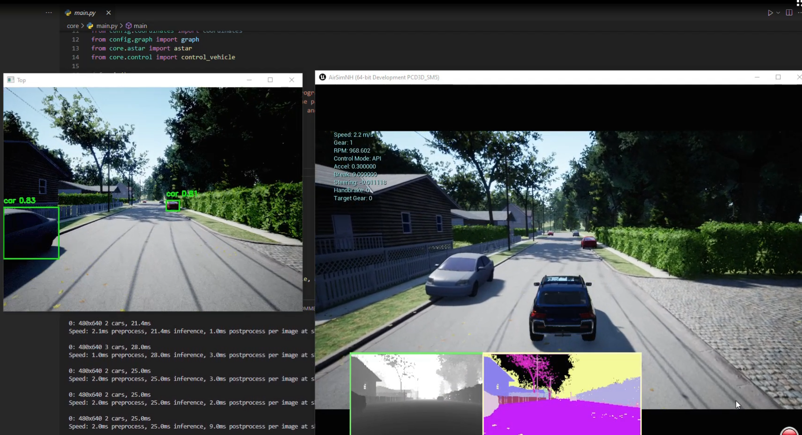

# Autonomous Vehicle Control System

This project demonstrates the control of an autonomous vehicle using A* pathfinding, sensor data integration, and object detection with YOLO. The system is designed to operate within a simulated environment provided by AirSim.

[](assets/test.mp4)

## Table of Contents

- [Introduction](#introduction)
- [Features](#features)
- [Installation](#installation)
- [Usage](#usage)
- [Project Structure](#project-structure)
- [Dependencies](#dependencies)

## Introduction

The Autonomous Vehicle Control System leverages A* pathfinding for navigation, integrates various sensor data for obstacle detection, and employs YOLO for object detection. The project aims to simulate autonomous vehicle behavior in a controlled environment.

## Features

- **A* Pathfinding Algorithm**: Efficient pathfinding from start to goal coordinates.
- **Sensor Data Integration**: Utilizes distance sensors to detect obstacles.
- **Object Detection**: Implements YOLOv5 for real-time object detection.
- **Pure Pursuit Control Algorithm**: Smooth path following for the vehicle.

## Installation

To set up the project, follow these steps:

1. **Clone the Repository**

    ```bash
    git clone https://github.com/oaslananka/Airsim101_Yolov10.git
    cd autonomous-vehicle-control
    ```

2. **Create a Virtual Environment**

    ```bash
    python -m venv venv
    source venv/bin/activate  # On Windows use `venv\Scripts\activate`
    ```

3. **Install Dependencies**

    ```bash
    pip install -r requirements.txt
    ```

4. **Install AirSim**

    Follow the instructions to install [AirSim](https://github.com/microsoft/AirSim).

## Usage

1. **Configure AirSim**: Ensure AirSim is correctly set up and running.
2. **Run the Main Script**

    ```bash
    python -m core.main
    ```

3. **Monitor Output**: The vehicle will start navigating the environment based on the defined path.

## Configurations

The project includes example AirSim configuration files to ensure optimal performance:

- **`configs/settings.example.json`**: Pre-configured AirSim settings for car simulation
- **`configs/README.md`**: Detailed setup guide and configuration explanations

### Quick Configuration Setup

1. Copy the example settings to your AirSim directory:
   ```bash
   cp configs/settings.example.json ~/Documents/AirSim/settings.json
   ```

2. Restart AirSim to apply the new settings

For detailed configuration options and troubleshooting, see [`configs/README.md`](configs/README.md).

## Project Structure

```plaintext
autonomous-vehicle-control/
│
├── README.md
├── requirements.txt
├── setup.py
│
├── config/
│   ├── __init__.py
│   ├── coordinates.py
│   └── graph.py
│
├── core/
│   ├── __init__.py
│   ├── astar.py
│   ├── control.py
│   ├── main.py
│   └── sensors.py
│
├── utils/
│   ├── __init__.py
│   └── common.py
│
├── detection/
    ├── __init__.py
    └── object_detection.py
```

## Dependencies

The project relies on several key libraries and frameworks:

- **numpy**: Fundamental package for scientific computing with Python.
- **opencv-python**: Library for computer vision.
- **ultralytics**: Implementation of the YOLO object detection model.
- **airsim**: Open-source simulator for autonomous vehicles from Microsoft AI & Research.

Install all dependencies using the provided \`requirements.txt\` file:

```bash
pip install -r requirements.txt
```

## Acknowledgments

- [AirSim](https://github.com/microsoft/AirSim) by Microsoft for the simulation environment.
- [Ultralytics YOLO](https://github.com/ultralytics) for the object detection model.
